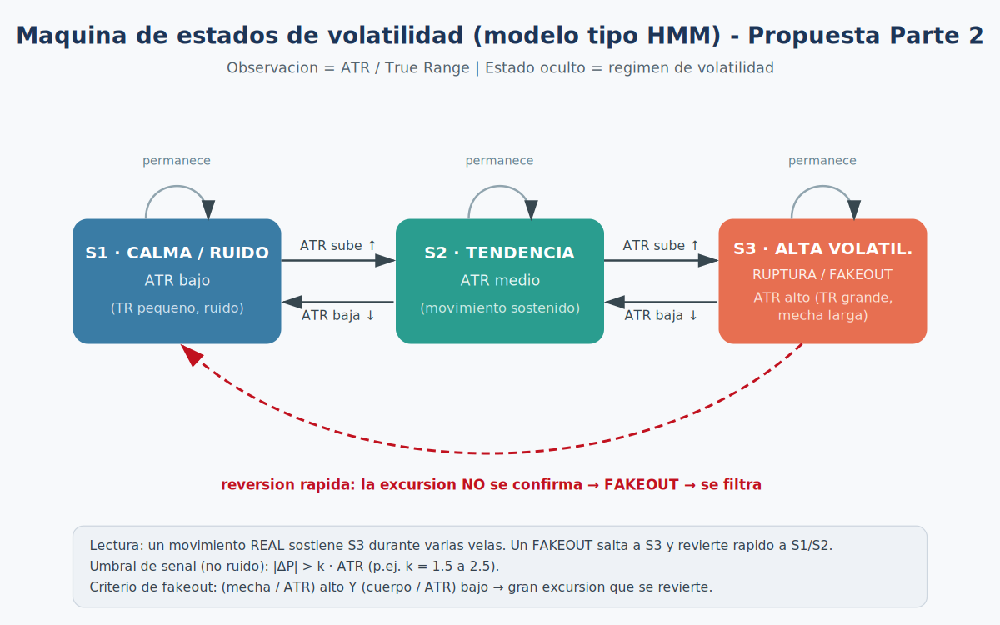

# Proyecto de Machine Learning — Parte 1
## Motor de Visualización de Datos Financieros (equivalente a TradingView)

Sistema de gráficos financieros (velas japonesas + indicador **ATR**) que replica las
funcionalidades básicas e intermedias de TradingView: velas OHLC, ejes de precio /
indicador / tiempo, scroll, zoom horizontal y vertical, *crosshair* sincronizado y
múltiples temporalidades (1m, 5m, 15m).

> **Nota de alcance (honestidad académica).**
> La **Parte 1** cubre el componente de **Visualización de Datos** y la preparación de
> características (OHLCV + ATR). En esta parte **no** se entrena ningún modelo de ML,
> **no** hay un autómata/HMM implementado y **no** hay un filtro de *fakeouts* codificado:
> esas piezas corresponden a la **Parte 2**. A lo largo del documento se marca:
> **`[IMPLEMENTADO]`** (ya está en el código) y **`[PARTE 2 · PROPUESTO]`** (enfoque para el 2.º bimestre).

---

## Tabla de contenido

1. [Descripción y arquitectura](#1-descripción-y-arquitectura)
2. [Cómo ejecutar el proyecto](#2-cómo-ejecutar-el-proyecto)
3. [Cómo usar la interfaz (controles)](#3-cómo-usar-la-interfaz-controles)
4. [Cómo leer el gráfico (velas)](#4-cómo-leer-el-gráfico-velas)
5. [Cómo se procesa el CSV](#5-cómo-se-procesa-el-csv)
6. [Limpieza de datos y manejo del ruido](#6-limpieza-de-datos-y-manejo-del-ruido)
7. [Lógica de programación](#7-lógica-de-programación)
8. [Autómata / estados de volatilidad (HMM)](#8-autómata--estados-de-volatilidad-hmm)
9. [El modelo de Machine Learning](#9-el-modelo-de-machine-learning)
10. [Qué falta para el 2.º bimestre](#10-qué-falta-para-el-2º-bimestre)
11. [Resumen de estado](#11-resumen-de-estado)

---

## 1. Descripción y arquitectura

**Datos de entrada:** CSV con 29 888 velas de 1 minuto (abril 2026); columnas
`time, open, high, low, close, Volume`.

La arquitectura tiene **dos capas** estrictamente separadas:

- **Backend (Perl)** — *solo lógica*. Lee el CSV, agrega timeframes, calcula el ATR y
  expone todo como una API JSON. Nunca mezcla cálculo con renderizado.
- **Frontend (JavaScript + Canvas)** — *solo renderizado e interacción*.

```
proyecto-trading-ml/
├── start.sh                         # lanzador (arranca servidor + abre navegador)
├── README.md
├── diagrama_estados_volatilidad.png
├── backend/
│   ├── app.pl                       # servidor Mojolicious + punto de entrada
│   ├── data/AAPL.csv                # datos OHLCV de 1m
│   └── Market/
│       ├── MarketData.pm            # almacenamiento OHLCV y timeframes
│       ├── IndicatorManager.pm      # gestión desacoplada de indicadores
│       └── Indicators/ATR.pm        # indicador Average True Range
└── frontend/
    ├── index.html                   # toolbar, 2 paneles, barra de estado
    ├── styles.css
    ├── scales.js                    # traducción datos <-> píxeles (transf. lineales)
    ├── price_panel.js               # velas, eje de precios, eje de tiempo
    ├── atr_panel.js                 # línea ATR (escala vertical propia)
    ├── chart_engine.js              # ventana visible, render y eventos
    └── app.js                       # arranque, fetch de datos, botones y teclado
```

> El enunciado original usa **Tk** para todo; aquí se separó la **lógica** (Perl) del
> **dibujo** (navegador). Se respetan igual los principios pedidos: separación
> cálculo/render, módulos desacoplados, POO, responsabilidad única y sin variables globales.

---

## 2. Cómo ejecutar el proyecto

**Requisitos (Fedora):** `perl` (de fábrica), `Mojolicious` (`sudo cpanm Mojolicious`) y un navegador.

**Forma simple (recomendada):**

```bash
./start.sh          # arranca el servidor y abre el navegador en http://localhost:3000
```

**Forma manual:**

```bash
cd ~/proyecto-trading-ml/backend
perl app.pl daemon -l http://*:3000
# luego abrir http://localhost:3000
```

Detener el servidor: `Ctrl + C`.

**API que expone el backend:**

| Ruta | Devuelve |
|------|----------|
| `GET /` | la página (`frontend/index.html`) |
| `GET /api/info` | resumen (conteos por timeframe) en JSON |
| `GET /api/candles?tf=1m` | `{ timeframe, candles[], atr[], anchors[] }` para ese timeframe |

```jsonc
// Ejemplo de /api/candles?tf=1m
{
  "timeframe": "1m",
  "candles": [ {"time":"...","open":..,"high":..,"low":..,"close":..,"volume":..}, ... ],
  "atr":     [ null, null, ..., 6.43, 6.56, ... ],   // alineado por índice con candles
  "anchors": [ {"index":0,"time":"...","hour":0,"is_new_day":1}, ... ]
}
```

---

## 3. Cómo usar la interfaz (controles)

### Toolbar (barra superior)

| Botón | Acción |
|-------|--------|
| `1m` `5m` `15m` | Cambian la temporalidad (agrupación de velas y escala de tiempo). El activo se resalta. |
| `Reset` | Restablece zoom y desplazamiento y reactiva la escala vertical automática. |
| `?` | Muestra u oculta la barra de estado inferior. |

### Ratón sobre el gráfico

| Control | Qué hace |
|---------|----------|
| **Clic izquierdo + arrastrar** | Scroll horizontal (mover en el tiempo). Derecha = pasado. |
| **Clic derecho + arrastrar** | Recorrido vertical del precio (pasa a escala manual). |
| **Rueda** | Zoom horizontal (tiempo); se ancla en la vela bajo el cursor. |
| **Shift + rueda** | Zoom vertical (precio); pasa a escala manual. |
| **Mover el cursor** | *Crosshair*: línea vertical **sincronizada en ambos paneles**; horizontal solo en el panel del cursor. |

### Teclado

| Tecla | Acción |
|-------|--------|
| `R` | Reset (como el botón). |
| `Q` | Quit — adaptado al navegador: detiene la sesión y avisa en la barra de estado. |

### Barra de estado (inferior)

- **Izquierda** — datos de la vela **bajo el cursor**: día de la semana + fecha + hora, y
  `O` apertura, `H` máximo, `L` mínimo, `C` cierre, más el valor `ATR`.
  Ej.: `jue 2026-04-30 21:29  O:27636.75 H:27639.25 L:27626.75 C:27638  ATR:3.79`
- **Derecha** — estado de la ventana: `TF 1m | barras 120 | offset 0`.

### Escala vertical: automática vs manual

Por defecto el eje de precios es **automático** (recalcula el rango para encajar las velas
visibles). Al usar **clic derecho** o **Shift + rueda** pasa a **manual** (congela tu rango).
`Reset` / `R` devuelve el modo automático. *(El panel ATR siempre es automático.)*

---

## 4. Cómo leer el gráfico (velas)

### Anatomía de una vela

Cada vela resume el precio en un intervalo (1, 5 o 15 min) con **4 valores OHLC**:

| Valor | Significado |
|-------|-------------|
| `O` (Open) | precio al inicio del intervalo |
| `H` (High) | precio más alto alcanzado |
| `L` (Low) | precio más bajo alcanzado |
| `C` (Close) | precio al final del intervalo |

- El **cuerpo** (barra ancha) va de la **apertura** al **cierre**.
- Las **mechas** o **sombras** (líneas finas, lo que llamaste *"llama"*) van del cuerpo hasta
  el **máximo** (arriba) y hasta el **mínimo** (abajo): muestran hasta dónde llegó el precio
  aunque no se quedara ahí.

```
       |        <- mecha superior (hasta el High)
    +-----+
    |     |     <- CUERPO (de Open a Close)
    +-----+
       |        <- mecha inferior (hasta el Low)
```

### Alcista vs bajista (color)

- **Alcista (verde, `#26a69a`)** — el cierre es mayor o igual que la apertura (`C ≥ O`): el precio **subió**.
- **Bajista (rojo, `#ef5350`)** — el cierre es menor que la apertura (`C < O`): el precio **bajó**.

### Interpretar una vela o secuencia

- Cuerpo grande verde/rojo → compra/venta **fuerte** (movimiento con convicción).
- Cuerpo pequeño con mechas largas → **indecisión** (el precio se movió mucho pero terminó cerca de donde abrió).
- Secuencia de velas verdes ascendentes → **tendencia alcista**; rojas descendentes → **bajista**.
- Mechas superiores largas repetidas → **rechazo** de precios altos; inferiores largas → rechazo de precios bajos.

### Identificar picos altos y bajos

- **Pico alto** (*swing high*): vela cuyo máximo supera a sus vecinas (una "cima").
- **Pico bajo** (*swing low*): lo contrario (un "valle").
- Se localizan en las cimas/valles del gráfico; con el *crosshair* lees el precio exacto en la barra de estado.

### Identificar la temporalidad

El botón activo (`1m`/`5m`/`15m`) y el texto `TF 1m` de la barra de estado indican la
temporalidad. Una vela de 5m resume 5 velas de 1m; una de 15m, 15. A mayor temporalidad,
cada vela cubre más tiempo y se ve **menos ruido**.

---

## 5. Cómo se procesa el CSV

### En general (lectura → almacenamiento) · **`[IMPLEMENTADO]`**

1. `app.pl` abre el CSV línea por línea, descarta la cabecera y separa por comas.
2. Por cada fila construye una **vela** (un hash) y la entrega a `MarketData` con `add_candle()`.
   Los números se convierten con `+ 0` (**numificación**) para que el JSON los emita como números, no como texto.
3. `MarketData` guarda las velas de 1m en un **arreglo** accesible por índice en O(1).

### En los tiempos específicos (agregación de timeframes) · **`[IMPLEMENTADO]`**

Las velas de 5m y 15m **se construyen** agrupando las de 1m (`build_tf_candles`). Para una
vela agregada a partir de `N` velas de 1m (`N` = 5 o 15):

```
Open   = Open de la PRIMERA vela del bloque
High   = MÁXIMO de todos los High del bloque
Low    = MÍNIMO de todos los Low del bloque
Close  = Close de la ÚLTIMA vela del bloque
Volume = SUMA de los volúmenes del bloque
```

> **No** se promedian precios (promediar borraría máximos/mínimos reales). El último bloque
> puede quedar incompleto y se incluye como **vela parcial** (como TradingView en vivo).

Resultado: **1m = 29 888**, **5m = 5 978**, **15m = 1 993** velas.

### Ventanas de tiempo · **`[IMPLEMENTADO]`**

- **Temporalidades (1m/5m/15m)** → definen el tamaño del bloque de agregación.
- **Ventana visible (`compute_window`)** → de las miles de velas solo se dibujan las que caben
  en pantalla, con dos variables:
  - `visible_bars` — cuántas velas se ven (lo cambia el zoom horizontal).
  - `offset` — cuántas velas desde el final estamos desplazados (lo cambia el scroll).

  Así el render es eficiente: se dibuja solo la porción visible (`get_slice` / `slice_array`).

---

## 6. Limpieza de datos y manejo del ruido

### ¿Hubo necesidad de limpieza? · **`[IMPLEMENTADO: mínima]`**

El dataset venía como OHLCV correcto (sin filas faltantes ni malformadas), por lo que **no**
fue necesario depurar valores inválidos ni eliminar *outliers*. El procesamiento aplicado fue:

- **Numificación** (texto → número) de `open/high/low/close/volume`.
- **Manejo de huecos de mercado**: hay vacíos de fin de semana y pausas de sesión
  (se confirmó: ~499 horas con datos de las 720 posibles del mes). **No** se rellenan; se
  *colapsan* dibujando **por índice** de vela en lugar de por hora de reloj, así el viernes
  queda pegado al lunes sin espacios vacíos (igual que TradingView).

### Formulación matemática del ruido · **`[ATR: IMPLEMENTADO]`**

Medida base de volatilidad — **True Range** por vela:

```
TR_t = max( H_t − L_t ,  |H_t − C_{t−1}| ,  |L_t − C_{t−1}| )
```

(se usa el cierre previo `C_{t−1}` para incluir los *saltos* entre velas).

**ATR** (Average True Range, periodo `n = 14`) — TR suavizado con el método de **Wilder**
(equivalente a un suavizado exponencial con `α = 1/n`):

```
ATR_n = (1/n) · Σ_{i=1..n} TR_i                # semilla = promedio simple
ATR_t = ((n−1)·ATR_{t−1} + TR_t) / n           # para t > n
      = ATR_{t−1} + (1/n)·(TR_t − ATR_{t−1})
```

El ATR cuantifica *cuánto se mueve normalmente el precio*: es la regla con la que se decide si
un movimiento es ruido o señal.

### Filtrado de picos pequeños y grandes (*fakeouts*)

> Contexto: hay picos diseñados para **engañar** al operador (barridos de stops / *fakeouts*).
> El objetivo es que el algoritmo no se deje engañar.

**Lo que ya ayuda (Parte 1) · `[IMPLEMENTADO]`**

- La **agregación de timeframe** actúa como **filtro paso-bajo**: un pico aislado de 1m que no
  representa *momentum* real queda absorbido dentro de una vela de 5m/15m (se vuelve una simple
  **mecha** en vez de una vela propia). La vela de 5m conserva el extremo real (max/min) pero
  colapsa 5 barras ruidosas en 1.
- El **ATR** provee el umbral de referencia para clasificar movimientos.

**Algoritmo propuesto · `[PARTE 2 · PROPUESTO]`**

- **Picos pequeños (micro-ruido):** un movimiento es **señal** solo si su excursión supera un
  umbral proporcional al ATR:
  ```
  |ΔP| > k · ATR_t          (p. ej. k entre 1.5 y 2.5)
  ```
  Si `|ΔP| ≤ k·ATR_t` → **ruido** (no accionable).
- **Picos grandes engañosos (rechazo/fakeout):** gran excursión que **se revierte**. Con las medidas de la vela:
  ```
  mecha_sup = H − max(O,C)
  mecha_inf = min(O,C) − L
  cuerpo    = |C − O|

  Criterio:  (mecha / ATR_t) > u_alto   Y   (cuerpo / ATR_t) < u_bajo
             ⇒ gran excursión que "volvió"  ⇒  FAKEOUT  ⇒  se filtra
  ```
- **Confirmación por régimen:** un movimiento real **sostiene** un régimen de alta volatilidad
  varias velas; un *fakeout* pincha y vuelve al régimen previo (ver §8).

---

## 7. Lógica de programación

Dónde y cómo vive la lógica, según los conceptos del curso.

### Desreferenciación (Perl) · **`[IMPLEMENTADO]`**

```perl
push @{ $self->{data}{'1m'} }, $candle;     # @{...}  desref de arrayref
scalar @{ $self->_active_array };           # contar elementos
$self->_active_array->[$index];             # ->[ ]   acceso a un elemento
return [ @{$arr}[ $start .. $end ] ];       # "array slice" + nuevo arrayref
$self->{data}{ $self->{timeframe} };        # cadena de desref de hash
my @out; ...; $self->{data}{$tf} = \@out;   # \@out  = crear una referencia
```

### Matrices / arreglos · **`[IMPLEMENTADO]`**

- Las velas son un **arreglo de hashes** (una "tabla": cada fila una vela con columnas O/H/L/C/V).
- Hay tres arreglos paralelos por temporalidad (1m, 5m, 15m).
- En el frontend, `candles` y `atr` son **arreglos paralelos**: `atr[i]` corresponde a `candles[i]`.
- `get_slice` / `slice()` obtienen submatrices (la ventana visible).

### Linealidad / transformaciones lineales / escalado · **`[IMPLEMENTADO — scales.js]`**

Es el núcleo matemático de la Parte 1. La traducción **datos ↔ pantalla** es una transformación **afín (lineal)**:

```
Eje X (índice de vela → píxel):
    x(i) = (i − first_index) · bar_width                 # lineal en i
    inversa:  i(x) = first_index + x / bar_width

Eje Y (precio → píxel), con normalización min–max y eje invertido (y=0 arriba):
    frac(v) = (v − min) / (max − min)        # escalado a [0,1]
    y(v)    = height − frac(v) · height
            = −(height/(max−min))·v + height·(1 + min/(max−min))   # forma y = a·v + b
    inversa:  v(y) = min + ((height − y)/height)·(max − min)
```

La normalización `(v − min)/(max − min)` es exactamente el **escalado de datos** a `[0,1]`,
el mismo concepto que se usará para normalizar características antes de entrenar el modelo en la Parte 2.

### Algoritmos utilizados · **`[IMPLEMENTADO]`**

- **Agregación OHLC** por bloques (construcción de timeframes).
- **Suavizado de Wilder / RMA** (media móvil recursiva) para el ATR; validado numéricamente
  contra un cálculo independiente (coincide a 10 decimales), equivalente al ATR por defecto de TradingView.
- **Escalado lineal (min–max)** e interpolación para el render.
- **Render incremental O(1):** `update_last()` actualiza el indicador con **una** vela por
  llamada; `request_render()` difiere el dibujo a un solo cuadro (`requestAnimationFrame`) para
  evitar redibujos redundantes.

### Tensores · **`[PARTE 2 · PROPUESTO]`**

En la Parte 1 no se usan tensores. En la Parte 2 las secuencias de velas e indicadores se
organizarán como tensores (p. ej. forma `[muestras, longitud_de_secuencia, n_características]`)
para alimentar la red recurrente.

### Librerías

- **Backend:** Perl núcleo + **Mojolicious** (servidor web/JSON).
- **Frontend:** JavaScript *vanilla* + **Canvas 2D** (sin frameworks).
- En la Parte 1 **no** se usó una librería de ML (eso es de la Parte 2).

---

## 8. Autómata / estados de volatilidad (HMM)

**¿Se usó un autómata (binario / Markov / HMM) en la Parte 1?** — **No.** El código de la
Parte 1 es visualización; no contiene cadena de Markov ni HMM. **`[PARTE 2 · PROPUESTO]`**

**Marco conceptual propuesto (apoyado en la volatilidad).** Se modela el mercado como un
proceso con **estados ocultos** de "régimen de volatilidad" (al estilo de un **HMM**), donde la
**observación** es el ATR / True Range. Tres estados:

| Estado | Régimen | ATR | Significado |
|--------|---------|-----|-------------|
| `S1` | Calma / Ruido | bajo | movimientos pequeños, ruido |
| `S2` | Tendencia | medio | movimientos sostenidos |
| `S3` | Alta volatilidad | alto | picos grandes, rupturas o *fakeouts* |

**Idea clave para no caer en *fakeouts*:** un movimiento **real** sostiene `S3` durante varias
velas; un **fakeout** salta a `S3` y **regresa rápido** a `S1`/`S2` (la excursión no se confirma) → se filtra.



> Para que la imagen se vea, deja `diagrama_estados_volatilidad.png` en la misma carpeta que este README.

<details>
<summary>Versión en texto (ASCII)</summary>

```
   permanece            permanece            permanece
  +------+   ATR sube   +------+   ATR sube   +-----------+
  |  S1  | ---------->  |  S2  | ---------->  |    S3     |
  |CALMA |              |TENDEN|              |ALTA VOLAT.|
  |RUIDO | <----------  | CIA  | <----------  |RUPTURA/   |
  +------+   ATR baja   +------+   ATR baja   |FAKEOUT    |
      ^                                       +-----------+
      |    reversión rápida (la excursión NO       |
      +------- se confirma) => FAKEOUT => filtrar <-+

  Observación = ATR / True Range ; Estado oculto = régimen de volatilidad.
```
</details>

---

## 9. El modelo de Machine Learning

**¿Qué modelo se usa / cómo se entrena?** — En la **Parte 1 no se entrena ningún modelo.**
**`[PARTE 2 · PROPUESTO]`** Esta parte construye lo que el modelo necesitará: datos OHLCV
limpios y accesibles por índice, características derivadas (ATR) y temporalidades sincronizadas.

Para la **Parte 2**, el enunciado especifica **modelos predictivos recurrentes**. Plan previsto:

- **Modelo:** red neuronal recurrente (**RNN / LSTM / GRU**), adecuada para secuencias temporales.
- **Entrada:** ventanas (secuencias) de velas + indicadores **normalizados** (mismo escalado min–max de §7).
- **Salida:** predicción del siguiente movimiento/precio (o de la dirección).
- **Entrenamiento:** división train/validación/test sobre la serie temporal, pérdida adecuada
  (p. ej. MSE), evitando fuga de datos del futuro.

---

## 11. Resumen de estado

**`[IMPLEMENTADO]` en la Parte 1**

- Lectura y almacenamiento del CSV (OHLCV).
- Construcción de timeframes 1m/5m/15m (agregación, sin promedios).
- Indicador ATR (Wilder) validado contra TradingView.
- API JSON (Mojolicious) y servidor.
- Visualización: velas, línea ATR, ejes, cuadrícula, etiquetas de tiempo con día de la semana.
- Interacción: scroll, zoom horizontal/vertical, *crosshair* sincronizado, botones de timeframe, `Reset`, atajos `R`/`Q`.
- Escalado lineal datos↔píxeles (transformaciones afines).
- Manejo de huecos de mercado por índice (colapso de sesiones).

**`[PARTE 2 · PROPUESTO]`**

- Filtrado matemático de ruido/*fakeouts* (umbral `k·ATR`, mecha/cuerpo).
- Máquina de estados / HMM de volatilidad.
- Tensores, modelo recurrente (RNN/LSTM), entrenamiento y predicción.